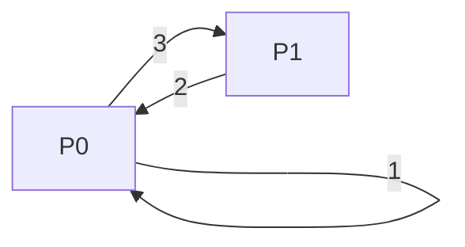

# org-focus-switch

Reconstruct the order in which you clocked tasks and answer:

1. **How often did I switch tasks?** — as a rate (switches per focused hour),
   the average uninterrupted focus-block length, and a **per-day distribution**.
   Frequent switching vs. long focus periods.
2. **How did priority move when I switched?** — a directed, weighted graph of
   `FOCUS_PRIORITY` transitions (P0 → P1, P1 → P1, …), grouped into
   **lateral / escalation / de-escalation** with a count each.

Org clocks tell you *how long* you spent on each task. This package tells you
*how you moved between them*.

## Two dashboards

| | Frequency summary | Per-day distribution | Direction tally | Transition matrix | Grouped edges | Export |
|--|:--:|:--:|:--:|:--:|:--:|:--:|
| **Org Focus Switch dashboard** (`C-c t s`) | ✓ | ✓ | ✓ | ✓ | ✓ | ✓ (`e`) |
| **org-focus dashboard** section (`C-c f d`) | ✓ | ✓ | ✓ | — | — | — |

The dedicated dashboard is the full view (and the only place graph export
works). The org-focus dashboard keeps a compact "Task Switching" section — the
headline numbers and the per-day distribution — and points to the full
dashboard for the transition graph.

## Commands

- `M-x org-focus-switch` — bound to `C-c t s` in Org buffers. Opens the
  read-only **Org Focus Switch dashboard** for the subtree at point; with a
  prefix (`C-u C-c t s`), the whole buffer.
- `M-x org-focus-switch-export` — export the transition graph (see
  [Export](#exporting-the-graph)). **Only works inside the dashboard**; also
  bound to `e` there.

## Example dashboard

```
Org Focus Switch Dashboard (buffer)

Switch frequency
Clock events:        5
Task switches:       4  (1.1 /focused-h)
Focus blocks:        5  (avg 42m each)
Clocked time:        3h 30m

Switches per day
  Date         Switches  /focused-h  Distribution
  2026-05-13          2         0.9  ██████████
  2026-05-14          2         1.6  ████████████████████

Priority transitions (from -> to)
         ->P0   ->P1   ->P2 ->none
P0          1      1      1      ·
P1          ·      ·      ·      ·
P2          1      ·      ·      ·
none        ·      ·      ·      ·

Lateral (1)
  P0   -> P0      1

Escalation (1)
  P2   -> P0      1

De-escalation (2)
  P0   -> P1      1
  P0   -> P2      1
```

The per-day **Distribution** bar is scaled to the busiest day, so the shape of
your switching over time is visible at a glance.

## How it works

- **Task identity** is the normalized heading (TODO state, priority cookie and
  tags stripped). The same recurring task logged across many days is *one*
  task; clocking it back-to-back is not a switch, but leaving and returning
  counts as two.
- **Leaf entries only**, `:private:` subtrees skipped, **closed clocks only** —
  matching the `org-focus` taxonomy.
- A **task switch** is a boundary between two consecutive (time-ordered) clock
  events with different tasks. Each switch contributes one edge
  `from-priority → to-priority`.
- **Direction** is by urgency rank (`org-focus-switch-priorities`, most urgent
  first; missing priority ranks last as `none`): moving to a more urgent level
  is an escalation, less urgent is a de-escalation, equal is lateral. Edges are
  grouped under those three headers, each showing its total switch count.
- The **per-day distribution** attributes each switch to the day of the task
  switched *to*, and reports, per day, the switch count and the rate per
  focused hour. Per-day counts sum to the overall total.

### Where priority comes from

Priority is resolved per clocked entry, in this order:

1. the **`FOCUS_PRIORITY` property**, **inherited** from ancestor headings when
   `org-focus-switch-priority-inherit` is non-nil (default) — so setting it once
   on a project/section heading covers every leaf beneath it;
2. failing that, Org's **native priority cookie** `[#A]`/`[#B]`/`[#C]`, mapped
   through `org-focus-switch-cookie-priority-alist` (default `A→P0, B→P1,
   C→P2`), when `org-focus-switch-use-priority-cookie` is non-nil (default).

Only when neither source yields a value does an event fall into the `none`
node. (If you ever see *only* `none → none` edges, none of your clocked entries
carry a priority in either form.)

## Exporting the graph

`M-x org-focus-switch-export` (or press `e` **in the dashboard** — export works
nowhere else) renders the priority-transition graph — a **directed weighted
graph**, nodes = priorities, edge weight = switch count, plus a `direction`
attribute — in a standard format:

| Format | Consumers |
|--------|-----------|
| **DOT** (Graphviz) | `dot -Tsvg`, most graph tools; edges coloured by direction, thickness = weight. |
| **Mermaid** | GitHub/Markdown, `mermaid.js`, many docs tools. |
| **GraphML** | Gephi, yEd, Cytoscape, NetworkX. |
| **CSV** | Spreadsheets, pandas; `from,to,weight,direction` edge list. |
| **JSON** | Anything; includes `nodes`, `edges`, and the headline `metrics`. |

The command operates on the graph the dashboard is currently showing (held
buffer-locally), prompts for the format, shows the result in
`*Org Task Switch Export*`, and offers to write it to a file with the right
extension. `org-focus-switch-to-format` is the pure `(DATA FORMAT) → string`
function behind it.

Example (Mermaid), paste into any Markdown that renders Mermaid:



### Session gap

Set `org-focus-switch-session-gap-minutes` to a positive integer to treat long
idle gaps (overnight, lunch) as session breaks: they start a new focus block
but are not counted as switches. Default `nil` counts every boundary.

## Integration with org-focus

`org-focus` requires this package optionally and, when it is on the
`load-path`, renders a compact "Task Switching" section in its dashboard over
the same scope (subtree or global) — the frequency summary, direction tally and
per-day distribution. The transition matrix, grouped edges and export live only
in the dedicated dashboard (`C-c t s`). No configuration is needed beyond
putting both directories on the `load-path`:

```elisp
(add-to-list 'load-path "/path/to/development/org-focus-switch")
(add-to-list 'load-path "/path/to/development/org-focus")
(require 'org-focus)      ; picks up org-focus-switch automatically
(org-focus-mode 1)
```

Everything is guarded by `fboundp`, so `org-focus` works unchanged if this
package is absent.

## Customization

| Variable | Default | Meaning |
|----------|---------|---------|
| `org-focus-switch-priorities` | `("P0" "P1" "P2")` | Priority levels, most urgent first. |
| `org-focus-switch-priority-property` | `"FOCUS_PRIORITY"` | Property holding the priority. |
| `org-focus-switch-priority-inherit` | `t` | Inherit the property from ancestors. |
| `org-focus-switch-use-priority-cookie` | `t` | Fall back to the `[#A]` cookie. |
| `org-focus-switch-cookie-priority-alist` | `((?A . "P0") (?B . "P1") (?C . "P2"))` | Cookie → label map. |
| `org-focus-switch-none-label` | `"none"` | Label for entries with no priority. |
| `org-focus-switch-exclude-tags` | `("private")` | Excluded (inherited) tags. |
| `org-focus-switch-session-gap-minutes` | `nil` | Idle gap that splits sessions. |
| `org-focus-switch-buffer-name` | `"*Org Focus Switch Dashboard*"` | Dashboard buffer. |
| `org-focus-switch-export-formats` | DOT/Mermaid/GraphML/CSV/JSON | Formats offered by export. |

## Tests

```sh
cd org-focus-switch
emacs --batch -l ert -l org-focus-switch.el -l org-focus-switch-tests.el \
      -f ert-run-tests-batch-and-exit
```

See [`SPEC.md`](SPEC.md) for the full data-model and API contract.
